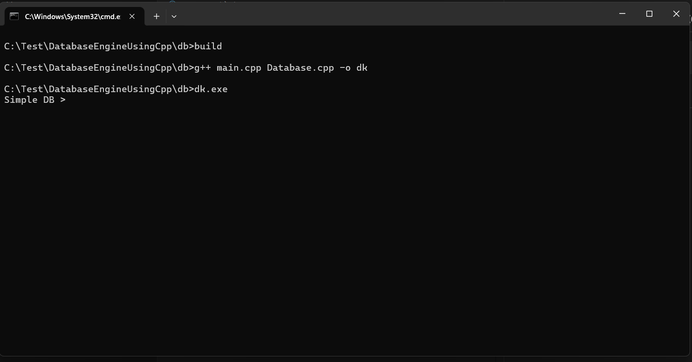

# Simple Database Engine in C++

A simple command-line database engine implemented in C++ that supports basic key-value operations.

## Features

- Insert key-value pairs
- Retrieve values by key
- Update existing keys
- Delete keys
- Check if keys exist
- Display all entries
- Count total entries
- Save database to file
- Load database from file

## Commands

The database supports the following commands:

- `INSERT <key> <value>` - Insert a new key-value pair
- `GET <key>` - Retrieve value for a given key
- `UPDATE <key> <value>` - Update value of an existing key
- `DELETE <key>` - Remove a key-value pair
- `EXISTS <key>` - Check if key exists (returns YES/NO)
- `COUNT` - Show number of entries
- `SHOWALL` - Display all key-value pairs
- `SAVE <filename>` - Save database to a file
- `LOAD <filename>` - Load database from a file
- `HELP` - Show all available commands
- `EXIT` - Quit the program

## Build Instructions

To build the project, run the `build.bat` file:

```
build.bat
```

This will compile the source files using g++ and run the executable.

## Usage

After building, run the executable:

```
dk.exe
```

The program will start with a prompt `Simple DB > ` where you can enter commands.

Example session:

```
Simple DB > INSERT name John
OK
Simple DB > GET name
John
Simple DB > UPDATE name Jane
OK
Simple DB > EXISTS name
YES
Simple DB > COUNT
1
Simple DB > SHOWALL
name: Jane
Simple DB > SAVE mydb.txt
SAVED
Simple DB > EXIT
```

## Files

- `main.cpp` - Main program with command-line interface
- `Database.cpp` - Implementation of the Database class
- `Database.h` - Header file for the Database class
- `build.bat` - Build script
- `db.txt` - Sample database file

# Commands to execute

```
build
```

# Output



# Summary

This is a simple in-memory key-value database engine written in C++. It provides basic CRUD operations and file persistence capabilities. The database uses an unordered_map for fast lookups and supports saving/loading data to/from text files.